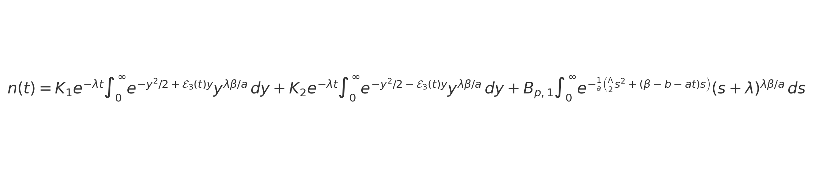
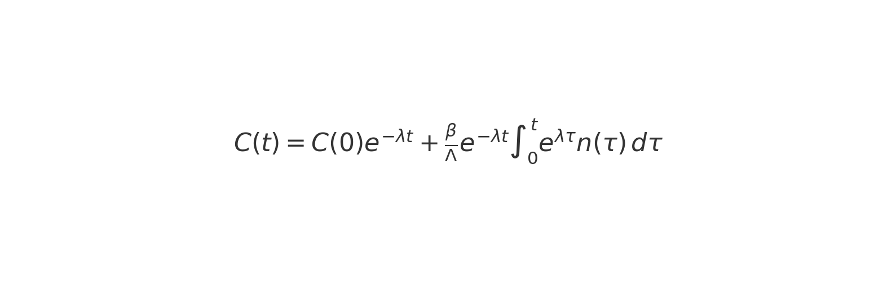

# Analytical Solution for the Neutron Point Kinetics Equations with Ramp Reactivity

The present repository contains the Python 3 codes associated with the development of a new analytical solution for the Neutron Point Kinetics Equations (NPKE), considering a single group of delayed neutron precursors and a linear ramp reactivity of the form  ρ(t) = a t + b.

These codes accompany the manuscript *Analytical solutions of the Neutron Point Kinetics Equations under a linear reactivity ramp*,  recently submitted to the **Computer Physics Communications** journal. Unless otherwise noted, all scripts are released under the **MIT License**.

**Authors:**  
Carlos-Antonio Cruz-López (cacl.nucl@gmail.com)  
Gilberto Espinosa-Paredes (gepe@xanum.uam.mx)
Claudia Andrea Vidales-Basurto (claudia.vidales@cimat.mx)
Guillermo Sánchez Lozano (guillermo.sanchez@ingenieria.unam.edu)

---

## Overview of the Repository

The repository contains five Python scripts. Each one implements a different component of the analytical or numerical framework used in the manuscript as well as the related script for performing comparisons.

---

### 1. `Neutron_density_SciPyNumPy.py`

This script implements the analytical solution of the neutron density n(t) using SciPy and NumPy, based on the following integral representation:

The code evaluates these integrals numerically using `scipy.integrate.quad` and determines the constants K₁ and K₂ through a least-squares procedure.

---

### 2. `Neutron_density_mpmath.py`

This version implements the same analytical solution for n(t), but using high-precision arithmetic through **mpmath** (`mp.mp.dps = 32` by default).

It includes:

- multiprecision versions of the six integrals I₁–I₆,  
- high-accuracy evaluation of the exponential/logarithmic structure of the analytical solution,  
- and a robust 2×2 linear solver (row/column scaling + Tikhonov regularization) ensuring numerical stability even under ill-conditioned cases.

This script is used as a benchmark to verify the sensitivity and conditioning of the proposed analytical formulation.

---

### 3. `C_precursor_SciPyNumPy.py`

This program computes the delayed neutron precursor concentration C(t) through the convolution integral:

The integral is evaluated numerically using `scipy.integrate.cumulative_trapezoid`.  
The script imports the analytical expression of n(t) from `Neutron_density_SciPyNumPy.py` and evaluates C(t) over a user-defined time mesh.

---

### 4. `RK4_reference_mpmath.py`

This code implements a fourth-order Runge–Kutta (RK4) integrator in 32-digit precision to solve directly the system of NPKE:

dn/dt = ((ρ(t) − β)/Λ) n(t) + λ C(t) + q  
dC/dt = (β/Λ) n(t) − λ C(t)  

with the linear reactivity ρ(t) = a t + b.

This solver provides a precise numerical reference (ground truth) to validate the analytical solution constructed in the manuscript.

---

## Software Specifications and Requirements

- Python ≥ 3.10  
- SciPy ≥ 1.10  
- NumPy ≥ 1.22  
- mpmath ≥ 1.3.0  

The codes were tested under a Windows 11 environment on a 3.8 GHz desktop computer with 32 GB of RAM.

---

## Financial Support

The authors appreciate the financial support received from the Consejo Nacional de Humanidades, Ciencia y Tecnología (CONAHCYT), under the program *Estancias Posdoctorales por México, 2022*, with the project entitled:  
**“Desarrollo de modelos fenomenológicos energéticos de orden fraccional, para la optimización y simulación en reactores nucleares de potencia”**,  
by which the present development was possible.

---

If you use or adapt this code, please cite the associated article once published.
